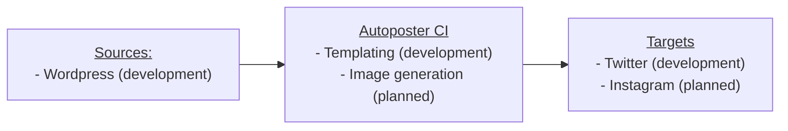

# Socialmedia autoposter CI

CI tool for automatic fetching articles and publishing to social media feeds.

Requirements:

1. Interchangeability of sources
2. Interchangeability of social media targets
3. Programmatic api: ability to insert custom code for filters, transformations and templates
4. Storing state in the repository
5. Triggered by CI cron (initially github actions)
6. Separately initialize state for post and actually post: ability to review posts in the future
7. Posting only when certain conditions are met: time of day, minimal delay since last post, etc.
