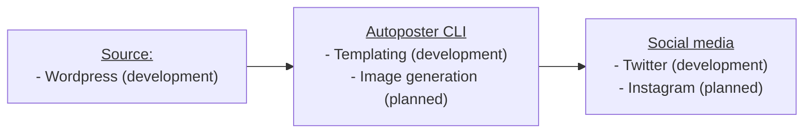

# Socialmedia autoposter CLI

CLI tool for automatic fetching articles and publishing to social media feeds.

```mermaid
flowchart LR
  Source --> Cli --> Socialmedia
  Source["<u>Source:</u><br />- Wordpress (development)"]
  Cli["<u>Autoposter CLI</u><br />- Templating (development)<br />- Image generation (planned)"]
  Socialmedia["<u>Social media</u><br />- Twitter (development)<br \>- Instagram (planned)"]

```
